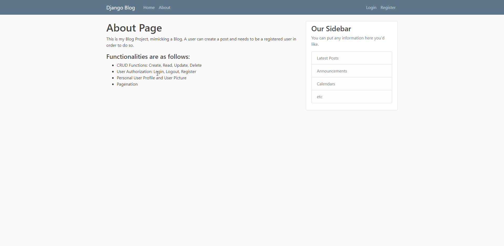

# Blog_Project
 This is my Blog Project, mimicking a Blog. A user can create a post and needs to be a registered user in order to do so.
       
       Functionalities are as follows:
      
       - CRUD Functions: Create, Read, Update, Delete 
       - User Authorization: Login, Logout, Register
       - Personal User Profile and User Picture
       - Pagenation
       
       

